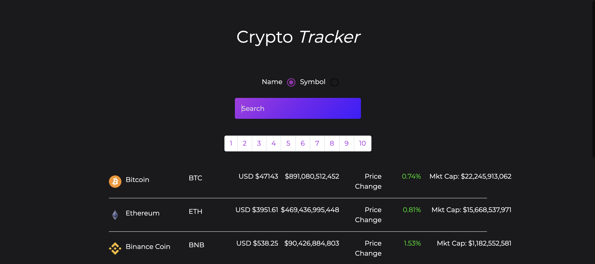
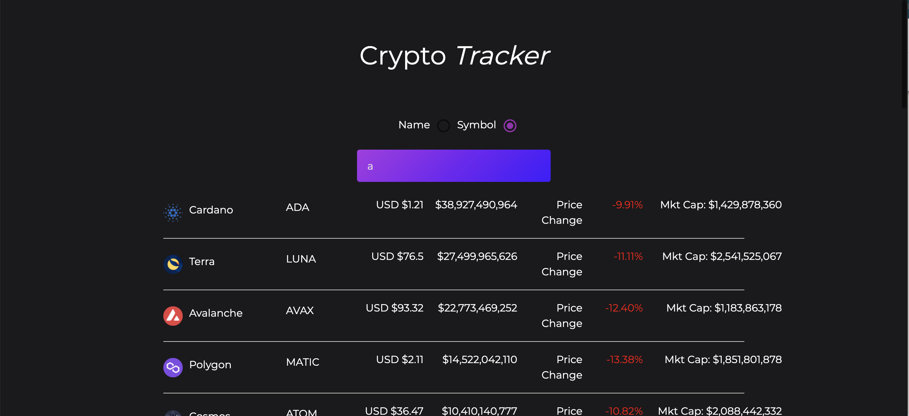

# Crypto Tracker

## Frontend Developer Coding Challenge

### Context

Cryptocurrency is an ever evolving space with new projects being created every day.
Our Traders need to be able to see the trending cryptocurrency projects and related
information.

### API

Coingecko provides lots of endpoints for further information you can use for free. I will be using this api to get the data.

##  

# Preview

## UI

Copied CSS and HTML from a Youtuber.

## The Landing Page

##  

## Search Crypto using name or symbol

##  

# The Product requirements

### The dot points are where you will find where the requirements were attempted/ met. All of these component are in the /src file.

1. Display a paginated list of Cryptocurrencies
   - App.js + Pagination.js
1. For the Visible Cryptocurrencies, provide further information in any form you find appropriate for this project.
   - Coin.js
1. Be able to filter the list by Cryptocurrency name / symbol
   - App.js
1. Provide a loading state whilst data is being pulled
   - useData.js
1. Provide an error state if the call fails
   - useData.js
1. Provide a unit test for the component
   - test/Coin.test/js
